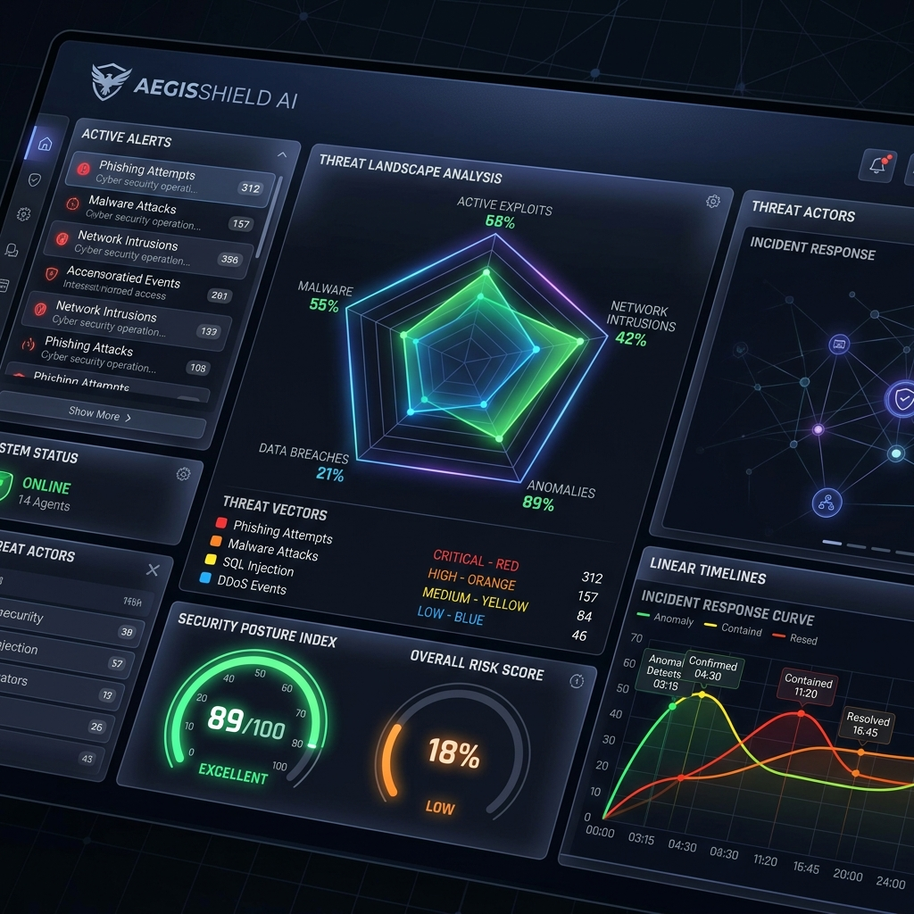
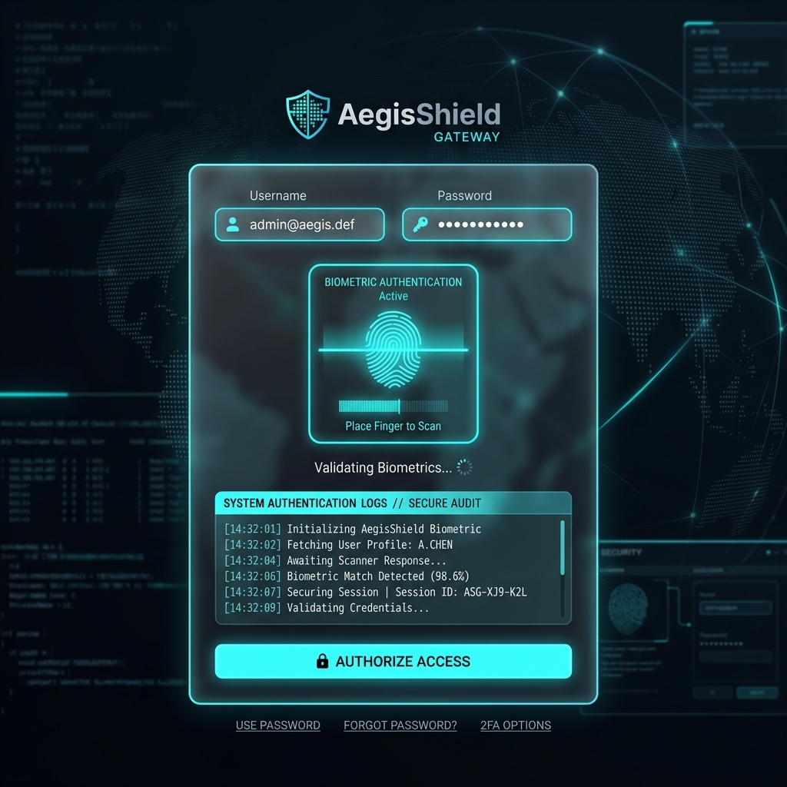

# AegisShield AI: Next-Gen Supply Chain & Active Threat Mitigation Platform

[](https://opensource.org/licenses/MIT)
[](#)
[](#)

<p align="center">
  
  
</p>

AegisShield AI is an industry-grade, full-stack cyber security demonstration platform designed to showcase advanced threat emulation, zero-trust active mitigation, and software supply chain verification. Built with a responsive, glassmorphic dark-mode dashboard, AegisShield AI empowers security evaluators to witness how sophisticated contemporary exploits can be audited, blocked, and remediated in real time.

---

## 🚀 Key Innovation Highlights

* **Simulated FIDO2 WebAuthn Gateway**: A gorgeous biometric scanner portal that models cryptographic challenge assertions, origin domain checking, and hardware key signatures, bypassing the risks of AiTM credential phishing.
* **Morphing SVG Radar Risk Profile**: A real-time mathematical radar visualization representing the system's active OWASP risk boundaries. As code patches are deployed, the polygon dynamically expands to full coverage.
* **Server-Sent Events (SSE) Exploit Streamer**: High-performance log streaming pipeline simulating Trojan postinstall execution, data exfiltration, and WAF intercepts in a scrollable, color-coded threat console.
* **Regulatory Compliance (CycloneDX SBOM)**: Fully featured Software Bill of Materials inspector capable of generating and exporting standard-compliant CycloneDX v1.5 JSON reports.
* **Interactive Security Audit Reports**: Generate and download a standalone, beautifully styled HTML security audit report mapping active vulnerabilities, mitigation statuses, and response timeline metrics.
* **Dynamic Personalized Operations Interface**: Time-based context greetings (Good morning/afternoon/evening/night) bound to the authenticated operator's user session ID.
* **Interactive Posture Audit Scanner Overlay**: A pre-dashboard active auditing module that runs static codebase scans, checks dependency vulnerabilities, and streams verification checkpoints via a rolling circular SVG radar sweep and neon-lit logs terminal before unlocking dashboard analytics.
* **Active Threat Geolocation Map (SVG Grid)**: A live geographical threat matrix representing simulated adversary C2 nodes routing attack payloads to host systems.
* **Policy Guardrail Event Logs (SIEM Card)**: A scrolling real-time security events console capturing WAF blocks, LLM sanitization triggers, and policy audit successes.
* **SOAR Incident Containment Workflow**: Integrated quarantine playbook that simulates automated host-isolation and Cloudflare WAF blocklisting upon unmitigated simulation breach.

---

## 🛠 Tech Stack

* **Frontend**: React (Vite), Vanilla CSS (Custom backdrop-filters, neon glows, custom scrollbars, and keyframe animations), Lucide Icons.
* **Backend**: Node.js + Express (SSE Streamers, Mock Codebase API).
* **Compliance Schema**: CycloneDX 1.5 JSON schema structure.

---

## 📁 System Architecture

```
aegisshield-ai/
├── backend/
│   ├── mockCodebase.js      # Vulnerable/Mitigated codebase representations
│   ├── simulations.js       # Scripted attack flow generators & logger hooks
│   ├── server.js            # Express API & SSE log streaming gateway
│   └── package.json
├── frontend/
│   ├── src/
│   │   ├── components/
│   │   │   ├── Login.jsx            # Secure Portal & WebAuthn touch simulator
│   │   │   ├── Dashboard.jsx        # SVG Radar and response latency timeline
│   │   │   ├── Emulator.jsx         # SVG Network Graph and console log streams
│   │   │   ├── CodeWorkspace.jsx   # Side-by-side patch debugger
│   │   │   └── SbomVisualizer.jsx   # CycloneDX supply chain auditor
│   │   ├── App.jsx                  # Main coordinator & metric calculator
│   │   ├── index.css                # Global glassmorphism theme stylesheet
│   │   └── main.jsx
│   ├── index.html
│   └── package.json
└── .gitignore
```

---

## 🔒 Threat Vectors & Mitigation Paradigms

| Threat Vector | CVE / Standard Reference | Active Defense Policy | Technical Remediation |
| :--- | :--- | :--- | :--- |
| **Supply Chain Trojan** | CVE-2026-38291 (XZ-Style) | SBOM Signature Verification | Upgrades transitive libraries; validates package lock checksum hashes against CycloneDX manifests. |
| **API Horizontal Scraping** | OWASP-API1:2023 (BOLA) | Zero-Trust ABAC Proxy | Injects owner tenancy check constraints in route middleware before querying SQL databases. |
| **LLM Chatbot Jailbreak** | OWASP-LLM01 (Prompt Inj) | Input/Output Guardrails | Isolates prompt context using developer-defined roles and scans inputs for adversarial injections. |
| **AiTM Session Hijacking** | OWASP-A01:2021 (Auth Leak) | FIDO2 WebAuthn Policy | Implements origin-bound hardware assertions; secures cookies via HttpOnly, Secure, and SameSite tags. |

---

## ⚙️ Running AegisShield AI Locally

### Prerequisites
Make sure you have [Node.js](https://nodejs.org/) installed (v16+ recommended).

### 1. Launch the Backend Server
```bash
cd backend
npm install
npm start
```
The server spins up at `http://localhost:5000`.

### 2. Launch the React Frontend
```bash
cd ../frontend
npm install
npm run dev
```
Open your browser at `http://localhost:5173`.

---

## 🎯 Verification & Evaluation Playground

1. **Authentication Access**: Access the portal via FIDO2 tab -> Click Fingerprint Scanner -> Note the WebAuthn logs and redirect.
2. **Launch Exploit Simulations**: Run any threat simulation in the **Threat Emulator** tab under "Vulnerable State" -> Witness the database breach on the active network flow.
3. **Configure Guardrails**: Toggle policy switches -> Re-run the attack -> Observe the WAF/Proxy intercept the payload midway.
4. **Deploy Code Patches**: Navigate to the **Vulnerability Workspace** -> Examine side-by-side diff comparisons -> Click "Apply Security Patch" -> Watch the **Security Posture Score** and **Radar Risk Pentagon** expand.
5. **Supply Chain Audit**: View the dependencies graph under **Supply Chain** -> Search outdated libraries -> Download the CycloneDX JSON SBOM manifest.
